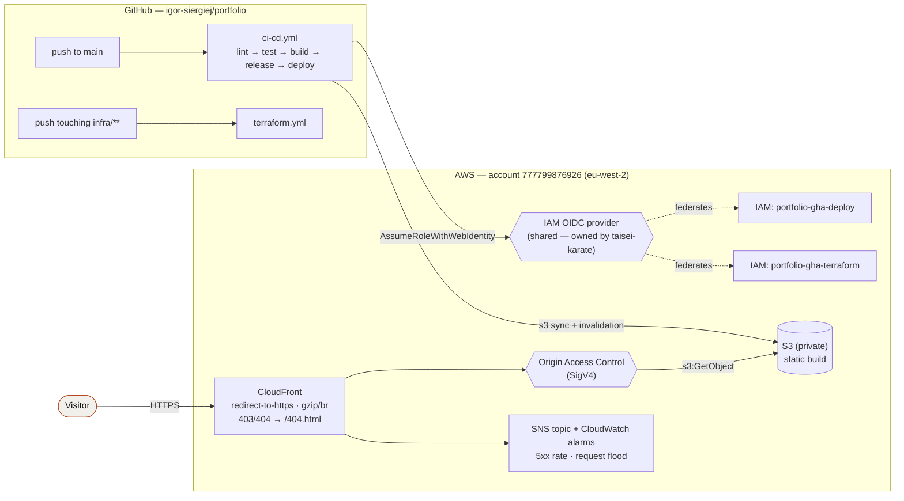

# Personal Portfolio Website — Design

**Date:** 2026-09-24
**Status:** Approved (pending spec review)
**Supersedes:** `igor-siergiej/personal-portfolio` (CRA + SCSS, archived, last pushed 2023-07-03)

## Goal

A portfolio-and-blog site for a full-stack engineer: deep project case studies plus
a technical writing surface, deployed as a static site on AWS alongside
`taisei-karate` in account `777799876926`.

Success criteria:

1. A recruiter skimming for 60 seconds learns what the engineer does, sees proof, and
   can reach the CV and an inbox.
2. An engineer who reads further finds real architectural detail — decisions and
   trade-offs, not feature lists.
3. Publishing a post or a case study is a markdown commit; deploying is a push to `main`.
4. No servers, no long-lived cloud credentials, no click-ops.

## Scope

**In:** home, projects index, project case studies, blog index, blog posts, RSS, about
page, CV PDF download, contact via mailto/social links.

**Out (deliberate):** contact form (no API Gateway/Lambda/SES — recruiters email),
`/uses` page (deferred until the homelab settles), CMS admin UI, comments, analytics,
i18n, custom domain at launch.

## Architecture



Static Astro build in a private S3 bucket, served through CloudFront with Origin Access
Control. Deploys assume an IAM role through GitHub OIDC. Identical in shape to
`taisei-karate`, with the contact-form and WAF subsystems omitted.

## Repository

New repo `igor-siergiej/portfolio`. The 2023 `personal-portfolio` repo stays archived as
history — a fresh repo avoids carrying a CRA tree and stale default branch into a clean
Astro project.

Scaffolded from `igor-siergiej/content-website-template`:

```bash
bunx degit igor-siergiej/content-website-template portfolio
cd portfolio && bun run init portfolio && bun install
```

### De-Keystatic first

The template ships Keystatic Cloud; this site authors content as files in the repo
(see "Content model"). Keystatic is removed as the **first commit after scaffolding**, so
no site code is built on top of dead scaffolding. Complete removal surface:

| File | Change |
|---|---|
| `astro.config.mjs` | Delete the custom `keystatic()` integration (lines 9-49) and its entry in `integrations`; drop the now-pointless `sitemap` filter for `/keystatic` |
| `keystatic.config.ts` | Delete |
| `src/pages/keystatic/` | Delete |
| `package.json` | Remove `@keystatic/astro`, `@keystatic/core` |
| `public/robots.txt` | Remove the `Disallow: /keystatic` line |
| `.github/workflows/ci-cd.yml` | Remove `/keystatic/index.html` from the deploy step's no-cache list |
| `infra/cloudfront.tf` | Delete the `keystatic_index` CloudFront Function and its `function_association`; change `X-Frame-Options` from `SAMEORIGIN` to `DENY` (SAMEORIGIN existed only because the Keystatic admin iframes the site) |
| `README.md` | Rewrite for this project |

## Content model

`src/content.config.ts` defines two collections.

### `posts`

Existing schema plus two fields:

| Field | Type | Notes |
|---|---|---|
| `title` | string | required |
| `description` | string? | used for meta description and index excerpt |
| `publishDate` | coerce.date | required for published posts |
| `coverImage` | string? | |
| `tags` | string[] | defaults `[]` |
| `draft` | boolean | defaults `false`; drafts excluded from index, RSS and sitemap at build time so unfinished posts can live on `main` |

### `projects`

| Field | Type | Notes |
|---|---|---|
| `title` | string | display name |
| `summary` | string | one-sentence description, used on home and index |
| `role` | string | e.g. "Solo — design, build, ops" |
| `period` | string | e.g. "2025 — present" |
| `stack` | string[] | rendered as mono chips |
| `repo` | string? | GitHub URL |
| `live` | string? | deployed URL |
| `status` | enum | `active` \| `maintained` \| `archived` |
| `featured` | number? | homepage sort key; absent = not featured |
| `cover` | string? | index/card image |
| `screenshots` | string[] | case-study gallery, defaults `[]` |

Case-study bodies follow one spine: **Problem → Approach → Architecture → Decisions &
trade-offs → Outcome**. Consistency is what makes them skimmable; freeform prose per
project is not.

Seed content (real projects, not placeholders): `shoppingo`, `jewellery-catalogue`,
`kivo`, `utils`, `foundry`, `taisei-karate` as current work; `database-visualiser`,
`diet-planner`, `PolyLingo` as `archived`.

## Routes

| Route | Source | Notes |
|---|---|---|
| `/` | `src/pages/index.astro` | hero, featured projects (by `featured`), latest 3 posts, stack, contact CTA |
| `/projects` | new | full index, grouped `active`/`maintained` then `archived` |
| `/projects/[slug]` | new | case study |
| `/blog` | renamed from `/posts` | index, drafts excluded |
| `/blog/[slug]` | renamed from `/posts/[slug]` | post |
| `/about` | new | bio, timeline, what I'm looking for |
| `/rss.xml` | existing, retargeted | posts only, absolute URLs |
| `/404` | existing | |
| `/cv.pdf` | `public/` | CV download |

The template's `/posts` route is renamed to `/blog` — `src/pages/posts/[slug].astro`,
`rss.xml.ts` and any internal links move together.

## Visual design

Direction: **editorial base with engineered detail** (mockup B + A hybrid). Reviewed as
static mockups before approval; the rejected alternatives were pure-terminal (A) and
aurora/bento (C).

**Type:** Fraunces (variable serif) for display headings; Inter for body; JetBrains Mono
for metadata — dates, reading times, stack chips, section kickers, index numbers.
Self-hosted via `@fontsource-variable` (the template already vendors Geist this way); no
Google Fonts request at runtime.

**Colour:** warm paper light theme (`#faf9f6` ground, `#16150f` ink) with a terracotta
accent (`#b4451f`); dark theme is a first-class variant, not an inversion — near-black
ground, warm off-white ink, accent lightened for contrast. Tokens live in
`src/styles.css` as CSS custom properties under `:root` / `.dark`, which is how Tailwind
v4 and the template's existing `theme-toggle.tsx` island already work.

**Layout:** generous whitespace and a serif-led hero (from B); hairline rules, mono
metadata columns and a table-style project index rather than soft cards (from A).
Screenshot frames on case studies borrowed from C.

**Components:** the shadcn set is trimmed to exactly what the site renders — `button`,
`card`, `badge`, `dropdown-menu` (theme toggle) and `sheet` (mobile nav). `accordion`,
`avatar`, `input` and `navigation-menu` are deleted, along with the template's
`src/components/sections/` landing-page set (`FAQ`, `Features`, `HeroCards`,
`ScrollToTop`), which exists for a promo site and has no place here. `Hero`, `Navbar`
and `Footer` are rewritten rather than reused.

**Accessibility:** WCAG AA contrast in both themes, visible focus rings, `prefers-reduced-motion`
honoured for every transition, semantic landmarks, skip link.

## Infrastructure

Terraform in `infra/`, mirroring `taisei-karate` with subsystems removed.

| Concern | Value |
|---|---|
| Account / region | `777799876926` / `eu-west-2` |
| `project` | `portfolio` |
| State | `s3://portfolio-tfstate-777799876926`, key `portfolio/terraform.tfstate`, native S3 locking, versioned |
| `domain_name` | `""` at launch — ships on `*.cloudfront.net`; attaching a domain later is a variable change plus apply |
| Price class | `PriceClass_100` |

### Shared OIDC provider (blocking issue)

The template's `infra/oidc.tf:6` creates `aws_iam_openid_connect_provider.github`
unconditionally. AWS allows exactly one provider per URL per account and `taisei-karate`
already owns `token.actions.githubusercontent.com` in this account, so an unmodified
scaffold **fails its first apply** with `EntityAlreadyExists`.

Fix: port the pattern from `taisei-karate/infra/oidc.tf:10-19` — gate creation on
`count = var.existing_oidc_provider_arn == "" ? 1 : 0` and resolve
`local.oidc_provider_arn` from the variable when set. Set:

```hcl
existing_oidc_provider_arn = "arn:aws:iam::777799876926:oidc-provider/token.actions.githubusercontent.com"
```

### OIDC subject claim

`var.github_repo` must match the subject GitHub actually issues. Verify before the first
apply:

```bash
gh api repos/igor-siergiej/portfolio/actions/oidc/customization/sub
```

If `sub_claim_prefix` is the immutable ID-suffixed form (as it is for `taisei-karate`
after its rename), use that string verbatim — a plain `owner/repo` value makes every
`AssumeRoleWithWebIdentity` call fail with "Not authorized".

### Monitoring and CloudTrail

Taisei bundles both behind one `enable_security_stack` flag. This project splits them:

- `enable_monitoring = true` — SNS topic + CloudWatch alarms (CloudFront 5xx rate,
  request flood), subscribed to `igorsiergiej@gmail.com`. The subscription confirmation
  email must be clicked or no alarm ever delivers.
- `enable_cloudtrail = false` — taisei's trail is **account-wide** and already captures
  this project's management events. AWS bills only one free copy of management events per
  account; a second trail pays again for identical data plus its own S3 storage. Flip to
  `true` only if this project's audit trail must outlive the taisei stack.

### Omitted from the taisei baseline

`contact.tf` (API Gateway + Lambda + SES) and `waf.tf` (~$8/mo) are not provisioned.
The site is static behind CloudFront with Shield Standard; there is no form to abuse.

### First apply

The state bucket cannot be created by the config that stores state in it:

```bash
aws s3 mb s3://portfolio-tfstate-777799876926 --region eu-west-2
aws s3api put-bucket-versioning --bucket portfolio-tfstate-777799876926 \
  --versioning-configuration Status=Enabled
cd infra && terraform init && terraform apply
```

## CI/CD

Template pipeline unchanged: `lint → test → build → release → deploy` on push to `main`,
plus `terraform.yml` (plan on PRs touching `infra/**`, apply on merge).

Repository variables set after the first apply:

| Variable | Source |
|---|---|
| `S3_BUCKET` | `terraform output -raw bucket_name` |
| `CLOUDFRONT_DISTRIBUTION_ID` | `terraform output -raw distribution_id` |
| `AWS_DEPLOY_ROLE_ARN` | `terraform output -raw deploy_role_arn` |
| `AWS_REGION` | `terraform output -raw aws_region` |
| `SITE_URL` | `terraform output -raw cloudfront_url` at launch; the real domain later |

`SITE_URL` is read at build time for every canonical URL, OG tag, sitemap and RSS entry.
Leaving it unset silently ships `http://localhost:4321` across the whole site.

## Testing

Tests exist where a plausible bug would otherwise ship silently.

**Vitest (unit):**

- Featured-project ordering — `featured` sort, absent values excluded.
- Draft filtering — `draft: true` excluded from index, RSS and sitemap.
- Reading time (already in template) — retained.

**Playwright (e2e smoke):**

- Home → project case study → back → blog post: navigation and rendered headings.
- `/rss.xml` parses as XML, contains absolute URLs against `SITE_URL`, excludes drafts.
- Theme toggle switches and persists across a reload.

**Not tested:** copy, markup structure, component internals, token values.

**Type safety:** CI runs `astro sync && tsc --noEmit` before tests, so a malformed
frontmatter field in any case study fails the build rather than rendering a broken page.

## Migration from the archived site

Carried over: the CV PDF (refreshed), and `database-visualiser`, `diet-planner`,
`PolyLingo` as `archived` project entries. Everything else — CRA scaffolding, SCSS
modules, logo PNGs, the old component tree — is dropped.

## Risks

| Risk | Mitigation |
|---|---|
| OIDC provider collision fails first apply | Conditional provider + `existing_oidc_provider_arn`, specified above |
| OIDC subject mismatch → all deploys unauthorised | Verify `sub_claim_prefix` via `gh api` before apply |
| Case studies never get written, site ships empty | Seed content is part of implementation scope, not a follow-up |
| Blog goes stale | Drafts can live on `main` behind `draft: true`; no cadence promised publicly |
| SNS subscription unconfirmed → silent alarms | Confirmation step called out in the deployment checklist |
